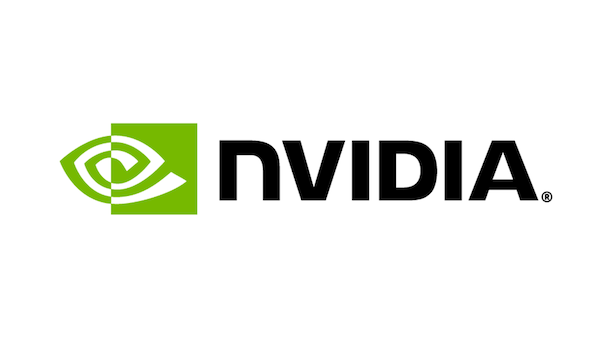
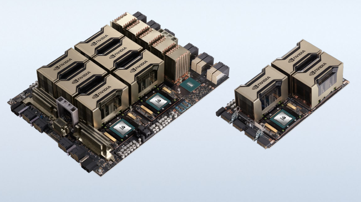
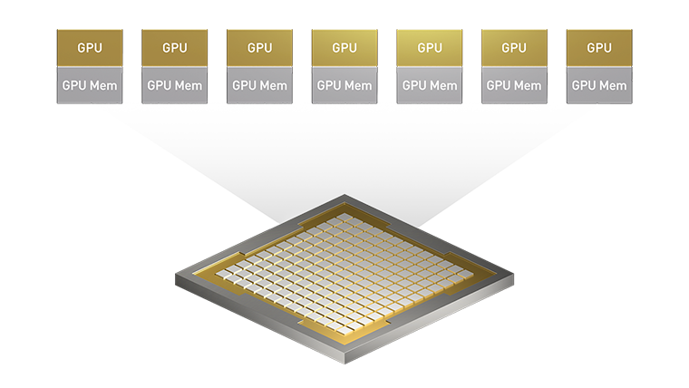
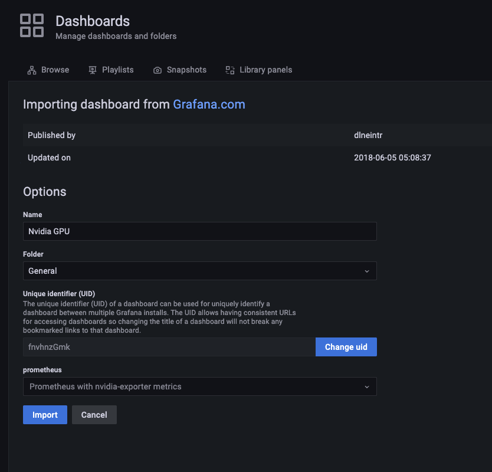

# Configuring GPUs and running GPU workloads on RKE2 (2023 edition)


## Introduction
This writeup and associated repo will be built for configuring RKE2 to handle GPUs and it will take into account developments that have occured in the last year or so that make doing so significantly easier to do both manually as well as tying into automation pipelines. I'll try to cover each subject contextually so you can make the best choice for your solution.

---

> **Table of Contents**
> * [Hardware Considerations](#hardware-considerations)
> * [Software Considerations](#software-considerations)
> * [Nvidia Operator Howto](#nvidia-operator)
> * [Metrics / Observability in Prometheus (via Rancher Monitoring too)](#metrics--observability)
> * [Running Workloads](#running-workloads)

---

## Hardware Considerations



Nvidia is going to be the subject of this doc, while it is possible to get AMD's GPUs up and working in RKE2 they are definitely less further along to the process than Nvidia and it will still require a good deal of manual effort.

Nvidia has essentially two different classifications of GPUs, I like to distinguish them as consumer and enterprise grade cards. On the bright-side, the consumer-grade cards are an AMAZING value for doing infrastructure testing and even development/POCs on. Many of them are quite fast and/or have significant amounts of VRAM available to do a lot of work. An RTX3060 card can be had with 12gb VRAM for relatively cheap (~$350 as of this writing) and makes for a great card running Stable Diffusion

Where Enterprise-grade cards shine the most is their featureset. Consumer cards are great at running single workloads but need significant assistance in order to share workloads. When running in Kubernetes like RKE2, being able to share multiple workloads across multiple nodes is one of the biggest reasons enterprise cards have become so popular. So not having some of these capabilities can prevent consumer cards from being a viable option in an enterprise and/or production deployment. This is aside from the fact that the enterprise cards come with significantly more capacity for gpu-compute and vram in addtion to better heat tolerance and longevity.



So when considering hardware, consider what you're trying to do. You cannot use MIG on consumer cards and even on many still-viable enterprise-grade cards, so sharing many workloads on a single GPU is just not possible in a memory/compute-secure manner (timeslicing is a different subject and isn't secure but that may not matter for you). If you don't need MIG and/or have many GPUs to share on multiple hosts, then you're good.

## Software Considerations

Diving into software for a minute, let's address when/where these workloads are going to run. The subject of this doc is going to be working within RKE2 which uses containerd by default as do most Kubernetes distributions. If you are using docker, then you are on your own as I haven't tested using docker on RKE2 and frankly the industry has moved away from docker running containers in Kubernetes. I tend to go where my customers are in terms of infrastructure dependencies and very very few are using docker in any capacity beyond building container images or the odd docker-compose on a VM somewhere.

RKE2 is Kubernetes and as such it is designed to abstract away the infrastructure running underneath it. This means RKE2 will function with nvidia GPUs as I describe whether you are running bare metal or hypervisor. If the PCI devices can get direct mapped to the RKE2 worker node(s) then you should meet success pretty easily when running in a hypervisor-based infrastructure. Bare metal is certainly easier to test but obviously significantly harder to automate as provisioning a bare metal machine is not a 'solved problem' quite yet even though there are solutions out there.

This doc assumes you have installed an RKE2 cluster on a typical 1/3 configuration for simplicity, so one control-plane node and 3 workers. You don't HAVE to have 3 workers, but that's just what I'm assuming here and you'll know why soon.

With a base configuration (without MIG), you are limited to physical GPUs mapped to each node. So if you have 3 workers and 1 GPU, only one of those workers can have a GPU available. This is a realistic scenario in most enterprise cases too because Kuberentes allows us to handle heterogeneous workloads based on its labeling and taint/toleration capabilities. After we're done with the operator install, Kubernetes will be able to map GPU workloads to the correct RKE2 nodes. However, the only way to run more than one workload (pod) using a GPU without significant 3rd party modification is to add another GPU.

-- insert graphic showing gpu to pod mapping --

With MIG, a single GPU can be sliced into multiple virtual devices (with their own secure memory space and compute) and be available to different pods, effectively sharing the GPU. Combined with multiple GPUs per node as well as multiple nodes with GPUs, the scalability of MIG is quite significant.



### Driver considerations

Nvidia's Linux drivers are quite easy to install regardless of your distribution (within reason). This is a consideration based on the nature of the Operator. The operator itself will install the driver if directed, but I have personally seen issues with the driver installation on RHEL and Rocky OS installations. Given how IBM/RHEL has gone closed-source, I wouldn't expect a community fix for this anytime soon. And due to the kernel-modification nature of the driver, some security teams require major changes to VM instances like that to go through vetting. This isn't just containers here, this is the actual driver as well as a specialized nvidia-containerd runtime.

Given the above and that I typically want a generalized solution that works for all, I usually install the driver as part of the VM provisioning process as opposed to letting the operator do it. Within Rancher MCM this is an easy `cloud-init` line, but the Nvidia drivers for most OS's are already handled by the OS-level package manager (`yum`,`rpm`,`dpkg`,`apt`,`zypper`). The driver itself is tightly coupled to the container image versions of each component in the operator. So when doing upgrades, this is something that will have to be watched closely.

For Ubuntu and SLES, this can be done using the `nvidia-driver-XYZ` package and may require a reboot. Using the `nvidia-smi` tool on the command-line can allow one to see the available GPUs.

Here I installed the `nvidia-driver-525` package in Ubuntu and this is the result of using `nvidia-smi` to verify the driver is running and communicating with the GPU. Be aware that the processes this is showing may differ from what you see as I am running my RKE2 singleton node on an Ubuntu Desktop instance.
```bash
Thu Jul 20 15:19:27 2023       
+-----------------------------------------------------------------------------+
| NVIDIA-SMI 525.125.06   Driver Version: 525.125.06   CUDA Version: 12.0     |
|-------------------------------+----------------------+----------------------+
| GPU  Name        Persistence-M| Bus-Id        Disp.A | Volatile Uncorr. ECC |
| Fan  Temp  Perf  Pwr:Usage/Cap|         Memory-Usage | GPU-Util  Compute M. |
|                               |                      |               MIG M. |
|===============================+======================+======================|
|   0  NVIDIA GeForce ...  Off  | 00000000:01:00.0  On |                  N/A |
|  0%   53C    P5    11W / 170W |    161MiB / 12288MiB |      0%      Default |
|                               |                      |                  N/A |
+-------------------------------+----------------------+----------------------+
                                                                               
+-----------------------------------------------------------------------------+
| Processes:                                                                  |
|  GPU   GI   CI        PID   Type   Process name                  GPU Memory |
|        ID   ID                                                   Usage      |
|=============================================================================|
|    0   N/A  N/A      1927      G   /usr/lib/xorg/Xorg                 87MiB |
|    0   N/A  N/A      2126      G   /usr/bin/gnome-shell               69MiB |
|    0   N/A  N/A      4653      G   gnome-control-center                2MiB |
+-----------------------------------------------------------------------------+
```

## Operator installation
The Nvidia operator is a K8S installable that will follow on with an install of a set of Nvidia tools designed to expose the GPU for containerized workloads in a Kubernetes-native way. It has a significant amount of features and they are exposed within the helmchart. The way we reference the operator here will cover the helmchart method. It has received significant upgrades in recent years which has made a lot of previous howtos around Nvidia GPUs and RKE2 or K8S obsolete. The biggest change is the capability of automatically modifying the containerd configuration on the node as well as installing the nvidia containerd runtime, both of which were manual efforts. This drastically reduces the amount of pre-setup for a GPU-based node, essentially making it no different than a regular node other than the PCI device mapping (or in AWS, you just ask for an EC2 instance with a gpu on it)

Below I'm going to cover changes that need to happen to the helm chart values file. Nvidia's comments are using the `#` notation, but mine will be the `#!` notation so we can see my comments inline. I have two helmchart values files in this repo, one is the default one from upstream Nvidia, the second is my modified one.

### Containerd modifications
The Nvidia operator expects the `containerd.toml` file and the `sock` file to be located in their default places. RKE2 doesn't use default vanilla K8S file locations, so we need to set those values. 

```yaml
toolkit:
  enabled: true
  repository: nvcr.io/nvidia/k8s
  image: container-toolkit
  version: v1.13.0-ubuntu20.04
  imagePullPolicy: IfNotPresent
  imagePullSecrets: []
  env: []  #! Here we set the containerd values using environment vars 
  #! env:
  #! - name: CONTAINERD_CONFIG
  #!   value: /var/lib/rancher/k3s/agent/etc/containerd/config.toml
  #! - name: CONTAINERD_SOCKET
  #!   value: /run/k3s/containerd/containerd.sock
  #! - name: CONTAINERD_RUNTIME_CLASS
  #!   value: nvidia
  #! - name: CONTAINERD_SET_AS_DEFAULT
  #!   value: 'true'
  #! resources: {}
  #! installDir: "/usr/local/nvidia"
```

### Driver Disable
As stated above, I'm installing the driver as a linux package on my base VMs. Because of that, I'm disabling the driver installer component in the operator:

```yaml
driver:
  enabled: true  #! Here we set the driver to disabled
  #! enabled: false   
```

### PSP
If you're using the cis-1.6 profile in RKE2, one of the changes it makes is in PSPs. 1.25 need not apply and uses a different mechanism. If you're using pre 1.25 RKE2 and have a secure or stig-compliant cluster, you'll need psp enabled

```yaml
psp:
  enabled: false  #! if you are using cis-1.6 profile (which you should be in a secured environment), you'll need the PSPs to get generated here. Unsure of 1.25 implications here
  #! enabled: true 
```

### MIG
By default the MIG manager is enabled and leaving it on will not affect non-MIG compliant devices as MIG-enabled devices at the driver level show up as physical interfaces. One thing to be aware of is in a multi-GPU arrangement on a single node. The mig strategy needs to be considered. Read [here](https://docs.nvidia.com/datacenter/cloud-native/kubernetes/latest/index.html#using-mig-strategies-in-kubernetes) for more information. I am leaving MIG ignored for now as I have no way of verifying various tweaks easily.

By default, the MIG installation will create a huge configmap that contains all possible configurations of MIG. Each nvidia GPU will have different available MIG configurations available to it. This is due to how the core and memory units are sliced up which depends on the overall total core count and video ram on the GPU.


### Helm Installation
Using helm, we can install the operator using the values file we have built. Ensure your kube context is pointed at a valid RKE2 instance with at least one GPU node.

```bash
helm repo add nvidia https://helm.ngc.nvidia.com/nvidia
helm install nvidia/gpu-operator -f operator_values_modified.yaml -n nvidia --create-namespace
```

Below is a snippet of the log to expect from helm. I used Rancher's UI to install this helm chart from the app catalog. Rancher's MCM will create a window pane at the bottom containing the streaming log of the helm process.
```bash
helm install --namespace=nvidia --timeout=10m0s --values=/home/shell/helm/values-gpu-operator-v23.3.2.yaml --version=v23.3.2 --wait=true gpu-operator /home/shell/helm/gpu-operator-v23.3.2.tgz
2023-07-20T15:29:24.469601568-04:00 creating 1 resource(s)
creating 2 resource(s)
...

NAME: gpu-operator
2023-07-20T15:29:36.874518765-04:00 LAST DEPLOYED: Thu Jul 20 19:29:24 2023
2023-07-20T15:29:36.874524072-04:00 NAMESPACE: nvidia
STATUS: deployed
REVISION: 1
2023-07-20T15:29:36.874537831-04:00 TEST SUITE: None

2023-07-20T15:29:36.878505171-04:00 ---------------------------------------------------------------------
SUCCESS: helm install --namespace=nvidia --timeout=10m0s --values=/home/shell/helm/values-gpu-operator-v23.3.2.yaml --version=v23.3.2 --wait=true gpu-operator /home/shell/helm/gpu-operator-v23.3.2.tgz
---------------------------------------------------------------------
```

After this point, the operator helmchart has installed correctly. However, this does not mean the install finished successfully. We need to watch the behavior of the operator itself to ensure all components start.

### Determining Successful Install
Because the install is using an operator, there is a second tier of things we need to watch to ensure the installation worked. The very first thing installed is going to be the `gpu-feature-discovery` set of workload objects. These pods will analyze the nodes to discover whether the nodes do indeed have a GPU available on them. If they are found then the rest of the process is kicked off.

After everything is finished, validation steps are performed by the operator to guarentee a good installation. But first we can look at most of the resources created in the namespace:
```bash
> kubectl get all -n nvidia
NAME                                                              READY   STATUS      RESTARTS   AGE
pod/gpu-feature-discovery-5czsj                                   1/1     Running     0          4m31s
pod/gpu-operator-7d64b94d7-h6mnd                                  1/1     Running     0          4m51s
pod/gpu-operator-node-feature-discovery-master-7db9bfdd5b-4c8w8   1/1     Running     0          4m51s
pod/gpu-operator-node-feature-discovery-worker-62bfd              1/1     Running     0          4m51s
pod/nvidia-container-toolkit-daemonset-m8jfv                      1/1     Running     0          4m31s
pod/nvidia-cuda-validator-z26kk                                   0/1     Completed   0          3m47s
pod/nvidia-dcgm-exporter-2zsqm                                    1/1     Running     0          4m31s
pod/nvidia-device-plugin-daemonset-4p484                          1/1     Running     0          4m31s
pod/nvidia-device-plugin-validator-fzrhs                          0/1     Completed   0          3m30s
pod/nvidia-operator-validator-px9gz                               1/1     Running     0          4m31s

NAME                                                 TYPE        CLUSTER-IP     EXTERNAL-IP   PORT(S)    AGE
service/gpu-operator                                 ClusterIP   10.43.23.103   <none>        8080/TCP   4m31s
service/gpu-operator-node-feature-discovery-master   ClusterIP   10.43.63.250   <none>        8080/TCP   4m51s
service/nvidia-dcgm-exporter                         ClusterIP   10.43.41.146   <none>        9400/TCP   4m31s

NAME                                                        DESIRED   CURRENT   READY   UP-TO-DATE   AVAILABLE   NODE SELECTOR                                      AGE
daemonset.apps/gpu-feature-discovery                        1         1         1       1            1           nvidia.com/gpu.deploy.gpu-feature-discovery=true   4m31s
daemonset.apps/gpu-operator-node-feature-discovery-worker   1         1         1       1            1           <none>                                             4m51s
daemonset.apps/nvidia-container-toolkit-daemonset           1         1         1       1            1           nvidia.com/gpu.deploy.container-toolkit=true       4m31s
daemonset.apps/nvidia-dcgm-exporter                         1         1         1       1            1           nvidia.com/gpu.deploy.dcgm-exporter=true           4m31s
daemonset.apps/nvidia-device-plugin-daemonset               1         1         1       1            1           nvidia.com/gpu.deploy.device-plugin=true           4m31s
daemonset.apps/nvidia-mig-manager                           0         0         0       0            0           nvidia.com/gpu.deploy.mig-manager=true             4m31s
daemonset.apps/nvidia-operator-validator                    1         1         1       1            1           nvidia.com/gpu.deploy.operator-validator=true      4m31s

NAME                                                         READY   UP-TO-DATE   AVAILABLE   AGE
deployment.apps/gpu-operator                                 1/1     1            1           4m51s
deployment.apps/gpu-operator-node-feature-discovery-master   1/1     1            1           4m51s

NAME                                                                    DESIRED   CURRENT   READY   AGE
replicaset.apps/gpu-operator-7d64b94d7                                  1         1         1       4m51s
replicaset.apps/gpu-operator-node-feature-discovery-master-7db9bfdd5b   1         1         1       4m51s
```

This looks good, all pods are either running or completed. One of the tests the operator runs is an `InitContainer` within the `nvidia-operator-validator` pod called `toolkit-validation`. You can inspect the log of this container and you should see `nvidia-smi` having successfully run. Much like we ran it on the host node earlier, this one is guarenteeing that it can also run within a container. This ensures both that the GPU is being correctly mapped to the container requesting it as well as the `nvidia-containerd` runtime being successfully executed. When you check, ensure you grab the correct pod name as it always has a UID suffix since it is part of a DaemonSet.

```bash
> kubectl logs nvidia-operator-validator-px9gz -n nvidia -c toolkit-validation
Thu Jul 20 19:33:11 2023       
+-----------------------------------------------------------------------------+
| NVIDIA-SMI 525.125.06   Driver Version: 525.125.06   CUDA Version: 12.0     |
|-------------------------------+----------------------+----------------------+
| GPU  Name        Persistence-M| Bus-Id        Disp.A | Volatile Uncorr. ECC |
| Fan  Temp  Perf  Pwr:Usage/Cap|         Memory-Usage | GPU-Util  Compute M. |
|                               |                      |               MIG M. |
|===============================+======================+======================|
|   0  NVIDIA GeForce ...  Off  | 00000000:01:00.0  On |                  N/A |
|  0%   54C    P5    11W / 170W |    161MiB / 12288MiB |      0%      Default |
|                               |                      |                  N/A |
+-------------------------------+----------------------+----------------------+
                                                                               
+-----------------------------------------------------------------------------+
| Processes:                                                                  |
|  GPU   GI   CI        PID   Type   Process name                  GPU Memory |
|        ID   ID                                                   Usage      |
|=============================================================================|
+-----------------------------------------------------------------------------+
```

### MIG Testing
While I don't have a good example of what MIG looks like when successfully mapped. It will be very similar to the above when the validator container is run. The key difference will be in the number and name of devices showing in the output. If I do get a good example of what MIG looks like in this process, I will show it here.

## Metrics / Observability
Part of the GPU operator called the `dcgm-exporter` will snag metrics from the GPU and report them so you can pull them into Prometheus. It is a simple tweak to a Prometheus install via helm to add in the extra scrape configs for this data. Nvidia also provides a canned GPU dashboard for visualization in Grafana. Combining these two together we can show the active metrics on the GPU device(s) including load and temperature. If we need something more sophisticated we can use this dashboard as a starting point as well!

Since I am using Rancher, I will use the Rancher Monitoring app from the catalog to install Prometheus and Grafana. We need to add an item to the (by default empty) additionalScapeConfigs list. Here is the section I need to modify within my helmchart values for `Rancher Monitoring`:
```yaml
prometheus:
  prometheusSpec:
    additionalScrapeConfigs:
    - job_name: gpu-metrics
      scrape_interval: 1s
      metrics_path: /metrics
      scheme: http
      kubernetes_sd_configs:
      - role: endpoints
        namespaces:
          names:
          - nvidia
      relabel_configs:
      - source_labels: [__meta_kubernetes_pod_node_name]
        action: replace
        target_label: kubernetes_node
```

### Grafana Dashboard
To add the Grafana Dashboard, I first need to log into the dashboard with admin priviledges. By default, Rancher puts you in observer mode, so you need to go grab the credentials on your own. If you're using your own Grafana installation, you should know your credentials from the installation. The secret is within `cattle-monitoring-system`:

```bash
> kubectl get secret rancher-monitoring-grafana -n cattle-monitoring-system -o yaml
apiVersion: v1
data:
  admin-password: cHJvbS1vcGVyYXRvcg==
  admin-user: YWRtaW4=
  ldap-toml: ""
kind: Secret
metadata:
  annotations:
    meta.helm.sh/release-name: rancher-monitoring
    meta.helm.sh/release-namespace: cattle-monitoring-system
  creationTimestamp: "2023-07-20T19:59:22Z"
  labels:
    app.kubernetes.io/instance: rancher-monitoring
    app.kubernetes.io/managed-by: Helm
    app.kubernetes.io/name: grafana
    app.kubernetes.io/version: 9.1.5
    helm.sh/chart: grafana-6.38.6
  name: rancher-monitoring-grafana
  namespace: cattle-monitoring-system
  resourceVersion: "19291"
  uid: d5b765ed-3ea1-41e1-a319-3d10b08b38ca
type: Opaque
```

I can use `base64 -d` to convert the `admin-password` field to a string and that is my admin password. Once logged in I can import the dashboard into Grafana. The dashboard is located [here](https://grafana.com/grafana/dashboards/6387-gpus/). You can paste that URL or the ID (ID is located on the website in the link).


## Running Workloads
This is probably the most discussed topic that I get questioned on. Once you've got the GPUs up and running, how do you PROVE they can do actual GPU-based work? Nvidia doesn't provide much help there and to be honest their test code using things like `vectoradd` is vastly sub-par on many levels. 

The biggest gripe I have with `vectoradd` and other examples is that while it is a container that Nvidia publishes, it is tightly coupled to the version of the driver you are using on the node. This breaks the Kubernetes/app-platform abstraction making a pod explicitly dependent on a very specific configuration at the node level. Many times `vectoradd` does not support the newest driver or whatever driver version a customer is using so they are forced to downgrade their drivers in order to run a test. This is silly.

The second biggest gripe is that `vectoradd` and other examples aren't really taxing the GPU at all. It's like having a racecar with track-ready suspesion, brakes, and huge powerband and 'testing' it by rolling around a parking lot. 


In the now-exploding AI market there are quite a few toolsets out there leveraging PyTorch and other apps in order to deliver outputs from AI modeling. The two most notorious at the time of publishing is ChatGPT and StableDiffusion/Midjourney. While we're still a ways off from ChatGPT running on RKE2 as the hardware requirements for it are reportedly HUGE, StableDiffusion is perfectly capable of running on a local machine with a single consumer-grade GPU. I found a semi-containerized version of an SD UI and was able to port it and run it in RKE2 on top of Harvester using a simple Ryzen9-based miniPC along with an RTX3060 GPU. It didn't always function perfectly as the front-end UI was not designed to work over a high-latency web-app interface. Now, 8 months later, the market has accelerated and there are other more mature container apps available now.

I recommend beginning your journey working to get Automatic1111 up and running as a K8S container. As this doc develops, I will go step by step on how I made that happen. But the beginnings are [here](https://github.com/AbdBarho/stable-diffusion-webui-docker/tree/master). This particular setup is designed around a docker-compose scheme, and while not exactly K8S-native, under the hood it builds the containers we need and can use. Everything here describes both how to make the containers, their source images, as well as ports/access that has to happen. So I will be working from this starting point. 

I have forked this repo for my use, and it is located here at [stable-diffusion-webui-kubernetes](https://github.com/bcdurden/stable-diffusion-webui-kubernetes)


### Deconstructing SD WebUI for Docker
Unfortunately, this app has been written using a pattern that does not translate well to enterprise systems. It is what I consider a 'self-modifying' containerized app and it breaks [12factor rule number 6](https://12factor.net/processes). This is mostly due to the nature of large model data being downloaded live at startup and shared among multiple docker compose apps. The model data should be represented as its own entity that is shared as a resource, but it is instead written as a container. I'm not quite sure what the author was considering here, I can see that having everything docker-compose might seem elegant, but it really just introduces statefulness to the containers that run where none should exist.

There's a few ways to solve this problem. The most straight-forward is to convert everything here into a single Pod where the download container is now a initcontainer. This is still a bit gross as everytime we spin it up it will re-download 12gb of files. Obviously that won't work in an airgap. What we need is something that translates to a persistent volume that we can store and manage as a container.

#### Translating Docker Compose to Kubernetes
When analyzing the download component, we can see the dockerfile for the `download` profile will download all 12gb of files into a shared directory that the other containers use. This has 90% of what we need here. Instead of downloading the 12gb of files at runtime, we'll move that command to something run at creation-time. Then we can add a runtime command that will untar the resulting model files into a persistent volume managed by Kubernetes.

This:
```Dockerfile
FROM bash:alpine3.15

RUN apk add parallel aria2
COPY . /docker
RUN chmod +x /docker/download.sh
ENTRYPOINT ["/docker/download.sh"]
```

becomes:
```Dockerfile
FROM bash:alpine3.15

RUN apk add parallel aria2
COPY . /docker
RUN chmod +x /docker/download.sh; chmod +x /docker/init.sh
RUN /docker/download.sh
ENTRYPOINT ["/docker/init.sh"]
```

Note that it is expecting an `init.sh` script. That is a new file located alongside the `download.sh` script. See the file [here](https://github.com/bcdurden/stable-diffusion-webui-kubernetes/blob/master/build/download/init.sh). This file will use a checksum file as a kind of passive lock. We can now build this image and run it as an init container.

TODO: extra stuff to translate

#### Building
From here we can begin building the containers. Let's use docker to do that since we are using the `Dockerfile` format. I'll write a small script that builds each docker file and tags the build with a registry of our choosing! 

The below should do it.
```bash
#!/bin/bash

if [ -z $REGISTRY ];
then
    echo "Please set the REGISTRY environment variable with your target registry"
    exit 1
fi

echo "Building all Images for target registry: $REGISTRY"
export DOCKER_BUILDKIT=1

# Keeping this scalable, let's just loop on all directories
for d in */; do
    echo "Building $d"
    pushd $d
        docker build -t $REGISTRY/stablediffusion/$d .
    popd
done

echo "Finished"
```

After building these images, I can see they are quite large, even without the downloaded models. Because of that, I'm going to pull this only from a local registry, because downloading 30+gb of files over and over is not something I want to do on my home cable internet. If you are intending on replicating this, ensure you've got some serious space in your homelab registry:

```console
ubuntu@sd-test:~$ docker images
REPOSITORY                                                 TAG       IMAGE ID       CREATED       SIZE
harbor.sienarfleet.systems/stablediffusion/invoke          latest    b06dd46970ba   5 hours ago   10.2GB
harbor.sienarfleet.systems/stablediffusion/download        latest    bc235974ad17   5 hours ago   10.3GB
harbor.sienarfleet.systems/stablediffusion/comfy           latest    23c857201616   5 hours ago   7.26GB
harbor.sienarfleet.systems/stablediffusion/automatic1111   latest    77608de8dcbc   5 hours ago   7.08GB
```

#### Basic Deployment
Next up is writing some basic Kubernetes code to wrap these images into something usable. We'll start with a basic K8S dpeloyment object and extend from there.

We can observe any command line args that we need to execute these containers by inspecting `docker-compose.yml`. For `automatic1111` we see this:

```yaml
  auto: &automatic
    <<: *base_service
    profiles: ["auto"]
    build: ./services/AUTOMATIC1111
    image: sd-auto:63
    environment:
      - CLI_ARGS=--allow-code --medvram --xformers --enable-insecure-extension-access --api
```

This tells me there is a parameter called `CLI_ARGS` getting injected at run-time. We can express this as a environment variable in the container itself, now we just need the entry point which can be found in the Dockerfile for the module.

```Dockerfile
FROM alpine/git:2.36.2 as download

COPY clone.sh /clone.sh

...

ENTRYPOINT ["/docker/entrypoint.sh"]
CMD python -u webui.py --listen --port 7860 ${CLI_ARGS}
```

Based on this, it appears to be already set, so there is no need to override. I can hop into my Rancher UI and quickly create a simple deployment with a single container. Here is the result below with excess comments and data removed for clarity. One thing I had to add was the resource reuquest for the GPU. This pod needs a GPU to function and this resource request will ensure K8S schedules the pod on a node with an available GPU. We can not put this in and it will still function, but kubernetes doesn't provide anything beyond integers when it comes to resources, we'd need a way to slice up the single gpu. Without mig, we can still use time-slicing but that is a topic for another time. I can also alter the command and entrypoint to ensure I'm listening on a port of my choosing. the `runtimeClassName` field is important here as this tells Kubernetes to utilize the nvidia containerd runtime.

```yaml
apiVersion: apps/v1
kind: Deployment
metadata:
  name: stablediffusion
  annotations: {}
  labels:
    workload.user.cattle.io/workloadselector: apps.deployment-default-stablediffusion
  namespace: default
spec:
  strategy:
    type: Recreate
  selector:
    matchLabels:
      workload.user.cattle.io/workloadselector: apps.deployment-default-stablediffusion
  template:
    metadata:
      labels:
        workload.user.cattle.io/workloadselector: apps.deployment-default-stablediffusion
      namespace: default
    spec:
      runtimeClassName: nvidia
      containers:
        - imagePullPolicy: Always
          name: automatic1111
          ports:
            - containerPort: 8080
              name: http
              protocol: TCP
          image: harbor.sienarfleet.systems/stablediffusion/automatic1111:latest
          args:
            - python 
            - -u 
            - webui.py
            - --listen 
            - --allow-code 
            - --medvram 
            - --xformers 
            - --enable-insecure-extension-access 
            - --api 
            - --port 
            - "8080"
          volumeMounts:
            - name: sd-data
              mountPath: /data
      imagePullSecrets: []
      restartPolicy: Always
      volumes:
        - persistentVolumeClaim:
            claimName: pvc-sd-data
          name: sd-data
  replicas: 1
```

We could deploy this, but we'd still be missing the models! Since we've altered the downloads module and moved the module download into a build-time process, we can use the resulting image containing all the models as an init container. I'll now add an init container through the rancher UI.

An init container entry would look like this:

```yaml
initContainers:
  - imagePullPolicy: IfNotPresent
    name: models
    active: true
    image: harbor.sienarfleet.systems/stablediffusion/download:latest
    command:
      - /docker/init.sh
    args:
      - /data
```

We have several more steps left! First, we need a persistent storage location that can map into the `/data` directory within each container of this pod. The initcontainer will write to this directory and the other containers will only read from it. We also need a persistent storage location for the outputs of each container. Luckily, this is also easy to setup in the Rancher UI. I'll not cover it here, but the whole deployment will be located in a single yaml file. See the [basic deployment file](deploy/basic.yaml) containing these along with the service and ingress objects.

To deploy this file, we just need to use kubectl: `kubectl apply -f deploy/basic.yml`